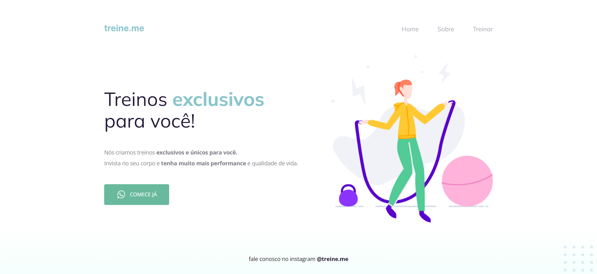

# Treine.me

O Treine.me é uma página simples desenvolvida dentro do programa Explorer da Rocketseat com o intuito de treinar tags semânticas e acessibilidade com HTML e CSS.

## :wrench: Tecnologias

- HTML
- CSS

## 📝 License

Este projeto está licenciado sob a Licença MIT - consulte o arquivo [LICENSE](LICENSE) para mais detalhes.

---

Feito com 💜 por Victor Nascimento
